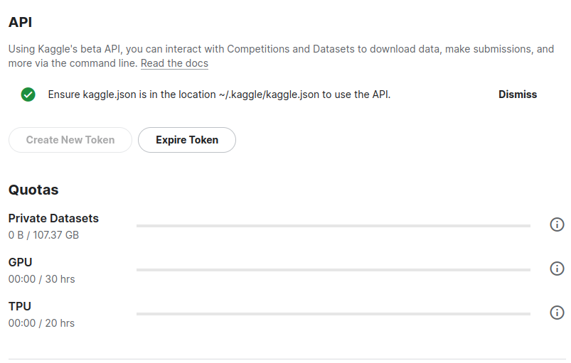

# Extract from Kaggle

## How to run
* __I. Create an account on Keaggle:__
    - `Go to https://www.kaggle.com/account/login?, and on register`

* __II. Get the credentials:__
    - `Go to https://www.kaggle.com/settings/account, and click on Create New Token, to download the kaggle.json file`
    - 
    - `Move the kaggle.json file to the this project directory`

* __III. Clone this repository:__
    - `git clone https://github.com/victor-s-santos/Extract_from_kaggle.git`

* __IV. Create and use the virtualenv:__
    - `python -m venv .venv`
    - `source .venv/bin/activate`

* __V. Run the python main file:__
    - `python main.py`
